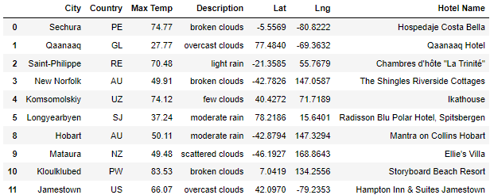
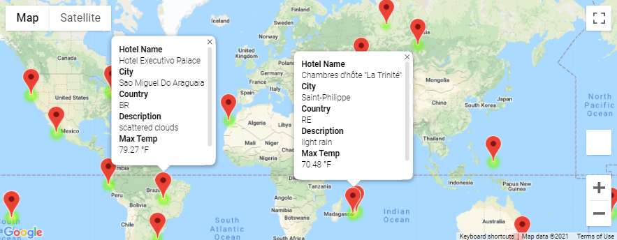
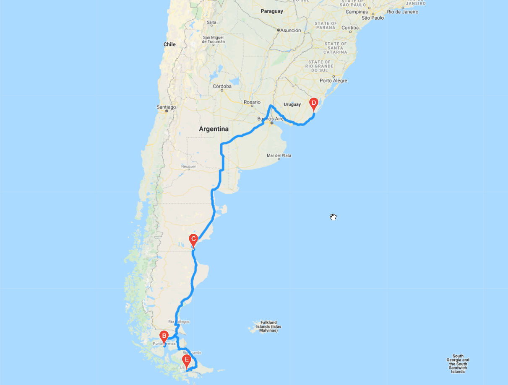
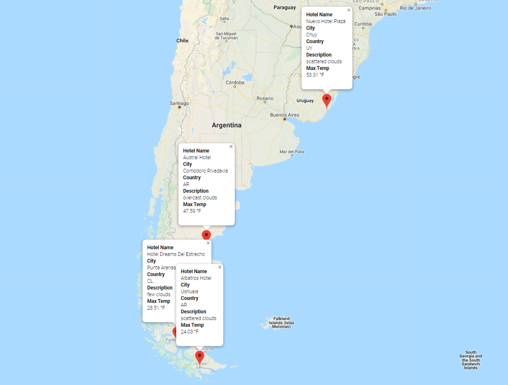

## World Weather Analysis
The purpose of this analysis was to retrieve weather data based off of user input, create a customer travel destination map based off of the weather input, and finally generate a customized travel itinerary map using the data pulled from a Google API call. 

As an example, if a user entered a temperature range of -20 deg. F to 100 deg. F, randomly generated latitude and longitude coordinates might yield the results in the dataframe below.
 

Based off of the Google API call, a map was generated with different locations that met the temperature criteria.
 

From those locations, 4 destinations were selected and a final travel map was generated to create a vacation itinerary with the nearest hotel being within 5,000m of the city of interest.
 
 
